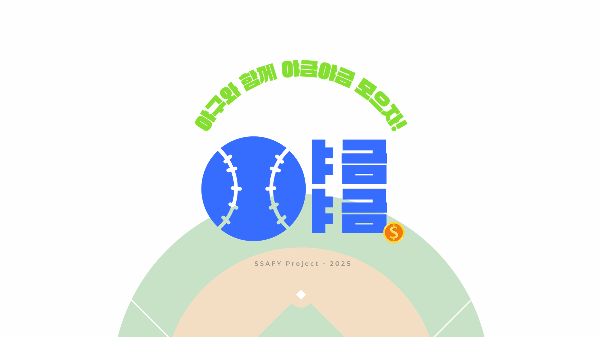
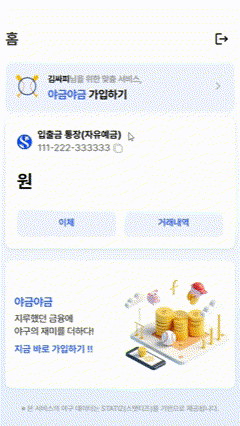
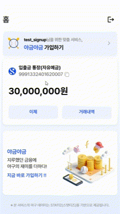
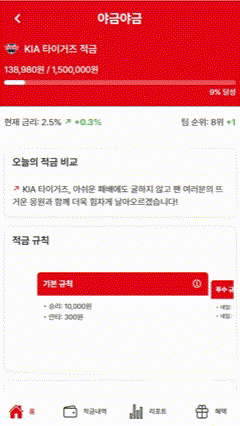
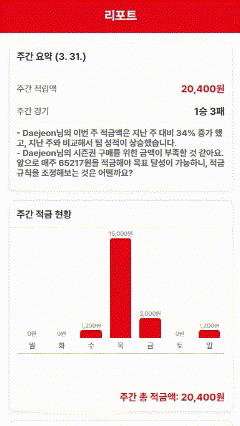
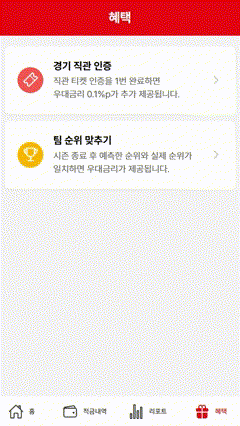
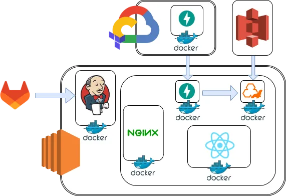
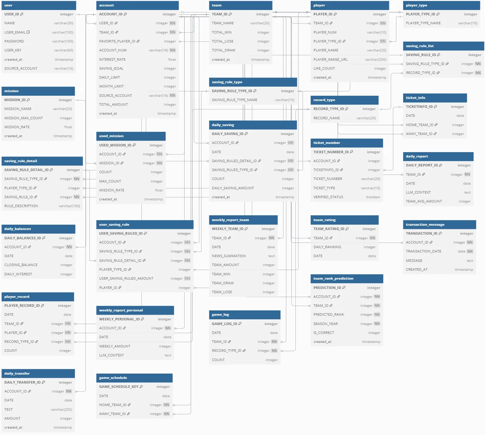
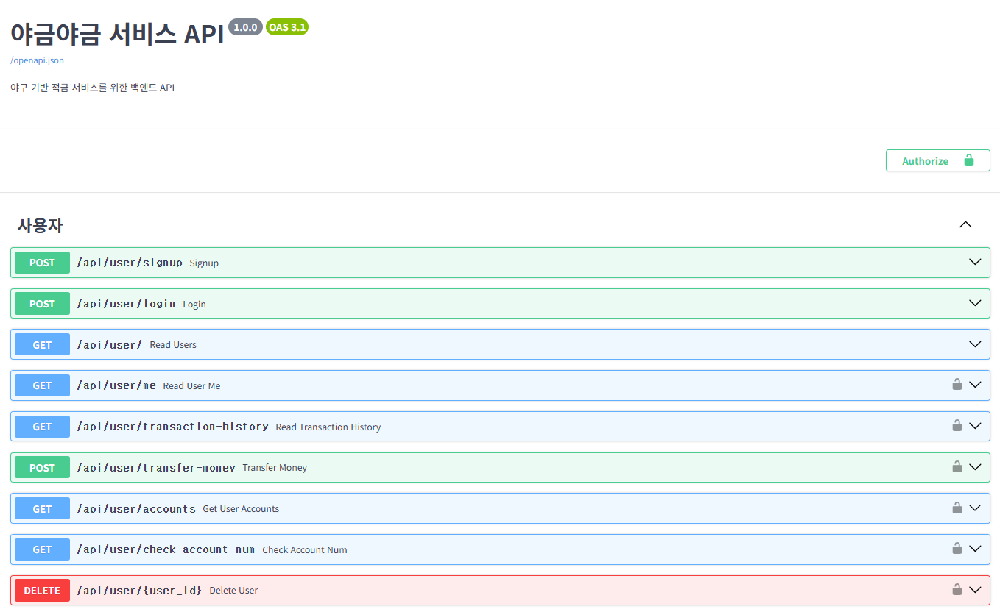
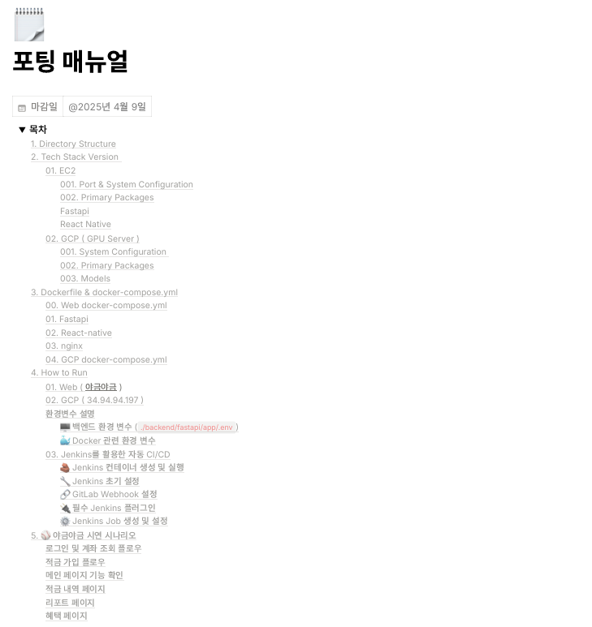

# ⚾️ 야구 팬들을 위한 자동 적금 서비스 야금야금 ⚾️

## 서비스 소개 영상

## 목차
[1. 서비스 소개](#1️⃣-서비스-소개)\
[2. 기능 소개](#2️⃣-기능-소개)\
[3. 주요기능](#3️⃣-주요기능)\
[4. 기술스택](#4️⃣-기술스택)\
[5. 시스템 아키텍쳐](#5️⃣-시스템-아키텍쳐)\
[6. ERD](#6️⃣-erd)\
[7. API 명세서](#7️⃣-api-명세서)\
[8. 포팅 매뉴얼](#8️⃣-포팅-매뉴얼)\
[9. 팀 구성원 및 역할](#9️⃣-팀-구성원-및-역할)

## 1️⃣ 서비스 소개

### ✅ 프로젝트 기간
---
> 25.03.03 ~ 25.04.11 (총 6주)

### ✅ 기획배경
---
* 기존에 은행, 핀테크 기업들이 통합 어플인 슈퍼앱을 만들어, 고객을 유인하고 "락인" 효과로 묶어두려고 하고 있음
* 야구 시범 경기 매진, KBO 빵의 매출을 통해 야구의 인기가 날로 늘어감을 알 수 있음
* 기존에 있던 신한은행의 야구 적금 서비스의 아쉬움, 카카오뱅크의 최애 적금의 불편함을 해소할 수 있는 자동 적금 시스템을 만들어보고자 함

## 2️⃣ 기능 소개

### ✅ 로그인 및 계좌 조회
- 아이디와 비밀번호를 입력하여 로그인하면, 계좌 조회 화면으로 이동
- 로그인 성공 시 금융 API와 연동하여 입출금 계좌와 잔액이 정상적으로 조회
- 계좌 조회 화면에서 야금야금 가입하기 버튼 클릭 시 금융상품 소개 페이지로 이동
- 입출금 통장의 이체, 거래내역 버튼을 통해 이체 기능 및 거래내역 조회 가능

### ✅ 적금 가입
- 가입하기 버튼 클릭 시 응원팀 선택 -> 응원팀 별 맞춤형 배경 색 적용
- 최애 선수 페이지에서, 최애 선수(투수 or 타자) 선택 -> 선수 등번호, 이름, 사진 표시 -> 검색 가능
- 적금 목표 페이지에서, "유니폼 구매", "내년 직관 금액", "시즌권 구매", "스프링 캠프" 중에서 목표 선택
- 적금 규칙 설정 페이지에서, 일일 한도 및 우리팀/최애 선수/상대팀 적금 규칙 ON/OFF와 금액을 설정
- 약관 조회 페이지에서, 약관에 동의하고 입출금 계좌를 출금 계좌로 선택
- 적금 가입 완료 페이지에서, 본인이 선택한 응원팀/최애 선수 확인 및 순위 예측 페이지로 이동할 수 있음

### ✅ 메인 페이지
- 상단에 팀명 및 팀 컬러에 맞는 UI 구현
- 목표 금액 및 현재 금액 bar, 금리 정보, 팀 순위 등의 정보 출력
- 오늘의 적금 비교 : AI를 활용하여 어제의 경기 결과 및 팀별 송금액 기반으로 요약 메세지 출력
- 적금 규칙 : 유저가 설정한 우리팀/최애 선수/상대팀 적금 규칙을 확인
- 최근 적금 내역 : 최근 3일 경기날짜, 상대팀, 경기 결과 및 송금액 확인
- 다음 경기 일정 : 앞으로의 6경기에 대한 경기날짜, 상대팀, 홈or원정 정보 확인

### ✅ 적금내역 페이지
- 캘린더 : 이번 시즌 야구 경기일정이 캘린더에 표시되고, 진행된 경기에 대한 결과 표시
- 경기 상세 정보 : 캘린더에서 클릭된 날짜에 대한 내용 표시
- 3연전 일정 : 3연전 3번에 대한 정보(상대팀/일자/승패/송금액 등) 확인
- 적금 상세내역 : 적금 납입 각각에 대한 금액/상대팀/납입일/송금 메세지(한줄) 확인
- 적금 상세내역 클릭 시 금액/상대팀/납입일/송금 메세지/규칙 별 송금액 등을 확인

### ✅ 주간 리포트 페이지
- 주간 요약 : 주간 적립액, 주간 경기 결과, AI를 활용해 적립액과 경기 결과를 기반으로 생성된 주간 요약 메세지 출력
- 주간 적금 현황 : 일주일 간 적금한 금액을 bar chart로 표현하고, 주간 총 적금액 출력
- 주간 뉴스 하이라이트 : 1주일 간 크롤링 된 뉴스 데이터를 기반으로 EXAONE 모델을 활용해 요약한 주간 뉴스 하이라이트 출력

### ✅ 혜택 페이지
- 경기 직관 인증 : 티켓 사진 업로드를 통해 티켓 인증 가능
  - 티켓이 사용되지 않았다면, 인증을 통해 우대금리 0.1% 부여(최대 5회)
  - 티켓이 이미 사용되었거나, 관련 없는 사진 업로드 시 경고 메세지 출력
  - 티켓 인증은 QR코드 및 OCR을 통해 티켓 번호를 출력하고, DB의 티켓 데이터와 비교
- 팀 순위 맞추기 : 응원 팀의 예상 순위를 선택하면, 정규시즌 종료 후 결과에 따라 우대금리 부여

## 3️⃣ 주요기능
| 로그인 | 계좌 조회 |
|---|---|
|  |  |

| 적금 가입 | 메인 페이지 |
|---|---|
|  |  |

| 적금내역 페이지 | 주간 리포트 페이지 |
|---|---|
|  |  |

| 경기 직관 인증 | 팀 순위 맞추기 |
|---|---|
|  |  |

## 4️⃣ 기술스택
<table>
  <tr>
    <th>프론트엔드</th>
    <td>
      
    </td>
  </tr>
  <tr>
    <th>백엔드</th>
    <td>
      
    </td>
  </tr>
  <tr>
    <th>데이터베이스</th>
    <td>
      
    </td>
  </tr>
  <tr>
    <th>Infra</th>
    <td>
      
      
      
      
      
      
    </td>
  </tr>
  <tr>
    <th>AI</th>
    <td>
      
      
    </td>
  </tr>
  <tr>
    <th>Tools</th>
    <td>
      
      
      
    </td>
  </tr>
</table>

## 5️⃣ 시스템 아키텍쳐

## 6️⃣ ERD

## 7️⃣ API 명세서

## 8️⃣ 포팅 매뉴얼

## 9️⃣ 팀 구성원 및 역할
<table>
  <tr>
    <td align="center">
      
    </td>
    <td align="center">
      
    </td>
    <td align="center">
      
    </td>
    <td align="center">
      
    </td>
    <td align="center">
      
    </td>
    <td align="center">
      
    </td>
  </tr>
  <tr>
    <td align="center"><strong>전제후</strong> <strong>AI</strong></td>
    <td align="center"><strong>정찬호</strong> <strong>Infra, PM</strong></td>
    <td align="center"><strong>김수민</strong> <strong>Data</strong></td>
    <td align="center"><strong>김의찬</strong> <strong>BE</strong></td>
    <td align="center"><strong>구민석</strong> <strong>FE</strong></td>
    <td align="center"><strong>박상호</strong> <strong>FE</strong></td>
  </tr>
</table>

※ 본 서비스의 야구 데이터는 STATIZ(스탯티즈)를 기반으로 제공됩니다.